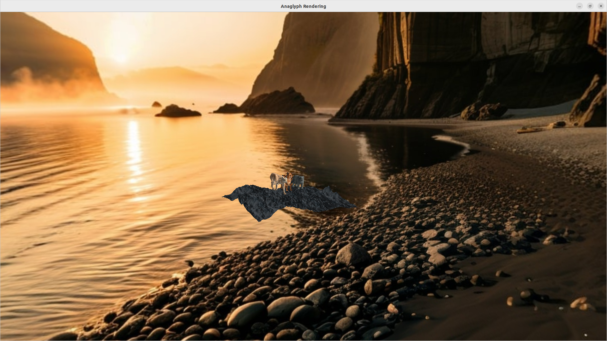

# FlyCats3D

Этот проект является продолжением проекта FlyCats. В нем реализована 3D-сцена с использованием OpenGL, включая стереоскопическую визуализацию на основе усеченных пирамид видимости. Вывод стереоскопической картинки основан на анаглифном методе. Расстояние конвергенции и стереобазы можно изменять динамически.

---



### 1. Особенности проекта
 - Стереоскопическая визуализация
 - Используется метод усеченных пирамид видимости для создания стереоскопического эффекта.
 - Реализован анаглифный метод вывода стереоскопической картинки.
 - Расстояние конвергенции и стереобазы можно изменять динамически.

### 2. Ландшафт
- Ландшафт загружается из файла высот (heightmap) и текстурируется.
- Реализовано вычисление нормалей для корректного отображения освещения.
- Ландшафт масштабируется и позиционируется на сцене.

### 3. 3D-модели
- Поддержка загрузки 3D-моделей в формате `.obj` с использованием библиотеки Assimp.
- Модели текстурируются с использованием диффузных карт и карт нормалей (для рельефного текстурирования).
- Модели размещаются на сцене в заданных координатах.

### 4. Рельефное текстурирование (Normal Mapping)
- Используются карты нормалей для создания эффекта рельефа на поверхностях.
- Реализовано в шейдерах с использованием TBN-матрицы (Tangent, Bitangent, Normal).

### 5. Скайбокс
- Скайбокс создает фон сцены, используя кубическую текстуру.
- Реализовано отсечение глубины для корректного отображения скайбокса.

### 6. Освещение
- Освещение реализовано по модели Блинна-Фонга.
- Включает ambient, diffuse и specular компоненты.
- Источник света может быть перемещен по сцене.

### 7. Камера
- Камера от первого лица позволяет перемещаться по сцене с помощью клавиш `W`, `A`, `S`, `D`.
- Вращение камеры реализовано с использованием углов Эйлера (yaw и pitch).
- Управление камерой осуществляется с помощью мыши.

---

## Зависимости

Для сборки и запуска проекта необходимы следующие библиотеки:

- **OpenGL** (версия 3.3 или выше)
- **GLFW** (для создания окна и обработки ввода)
- **GLEW** (для работы с расширениями OpenGL)
- **GLM** (для математических операций с векторами и матрицами)
- **Assimp** (для загрузки 3D-моделей)
- **stb_image** (для загрузки текстур)

---

## Сборка и запуск

### Запуск из исходников

#### 1. Клонируйте репозиторий
Склонируйте репозиторий на ваш компьютер:

```bash
git clone https://github.com/Vasilevykh-M/FlyCats.git
cd FlyCats
```

#### 2. Установите зависимости

Убедитесь, что все необходимые библиотеки установлены в вашей системе. Например, на Ubuntu:

```bash
sudo apt install libglfw3-dev libglew-dev libglm-dev libassimp-dev
```

#### 3. Соберите проект

Создайте директорию для сборки и запустите CMake:

```bash
mkdir build
cd build
cmake ..
make
```

После успешной сборки в директории `build` появится исполняемый файл `OpenGLExample`.

#### 4. Запустите программу

После успешной сборки запустите программу:

```bash
cd ..
./run.sh
```

### Запуск из Docker-контейнера
Если вы хотите запустить проект в изолированной среде, вы можете использовать Docker. Для этого выполните следующие шаги:

#### 1. Установите Docker
Убедитесь, что Docker установлен на вашем компьютере. Если Docker не установлен, следуйте официальной документации: Install Docker.

#### 2. Соберите Docker-образ
Перейдите в корневую директорию проекта и выполните команду для сборки Docker-образа:

```bash
docker build -t opengl-scene .
```

#### 3. Разрешите доступ к X11 на хосте
На хосте (вашем компьютере) выполните следующую команду, чтобы разрешить доступ к X11 для всех пользователей (включая Docker-контейнер):
```bash
xhost +local:root
```
Эта команда временно разрешает доступ к X11. Если вы хотите отменить это разрешение после завершения работы с Docker, выполните:
```bash
xhost -local:root
```

#### 4. Запустите контейнер
Запустите контейнер с доступом к графической системе хоста (X11):


```bash
docker run -it --rm \
  -e DISPLAY=$DISPLAY \  # Передаем переменную DISPLAY
  -v /tmp/.X11-unix:/tmp/.X11-unix \  # Подключаем сокет X11
  opengl-scene
```

#### 5. Использование GPU (опционально)
Если у вас есть NVIDIA GPU, установите NVIDIA Container Toolkit и используйте флаг --gpus all для ускорения OpenGL:

```bash
docker run -it --rm \
  --gpus all \  # Используем GPU
  -e DISPLAY=$DISPLAY \  # Передаем переменную DISPLAY
  -v /tmp/.X11-unix:/tmp/.X11-unix \  # Подключаем сокет X11
  opengl-scene
```


### Управление

- **Перемещение**: `W`, `A`, `S`, `D`  
- **Вращение камеры**: Движение мыши
- **Изменение конвергенции**:
    - `Up Arrow`: Увеличить расстояние конвергенции.
    - `Down Arrow`: Уменьшить расстояние конвергенции.  
- **Выход**: `Esc`  

## Структура проекта

- **`main.cpp`**: Основной файл программы, содержащий логику инициализации, рендеринга и управления.  
- **`CMakeLists.txt`**: Файл для сборки проекта с помощью CMake.  
- **`img/`**: Директория с текстурами для ландшафта, моделей и скайбокса, с 3D-моделями в формате `.obj`.  
- **`run.sh`**: Файл с переменными окружения для загрузки путей к ресурсам и запуска проекта.  

## Скриншоты


